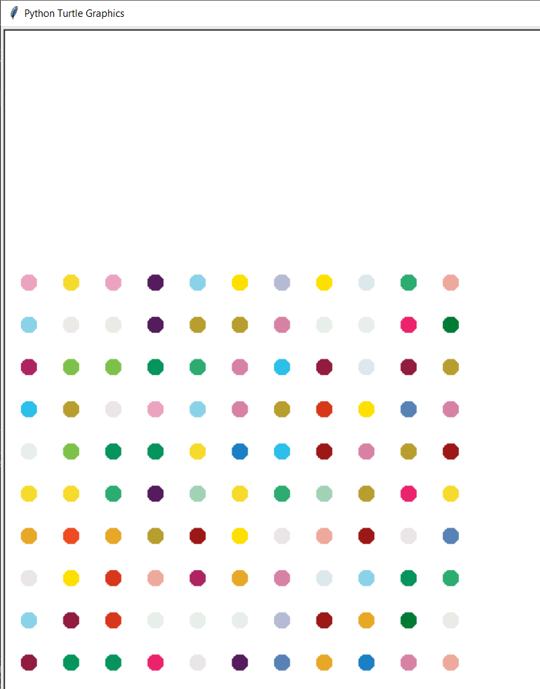

##Hirst Spot Painting

Turtle is a very important module in python which is used to create graphics.
This code generates dots of random colors which are equally spaced.It is basically a model of a famous painting - Hirst Spot Painting.
You can read about it [here.](https://www.damienhirst.com/texts1/series/spots)

This is how its output looks like:

